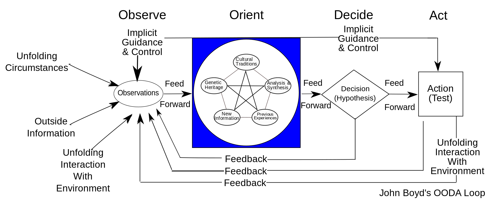

# Why Silicon Valley Matters
Workshop in VMFive 2015.07.09, given by Ofa

## 名言佳句

歷史的經驗告訴我們，當大部份的聰明人介入同一個領域的時候，它的時代已經來臨。 
--- 李開復

## 矽谷概觀
### 與眾不同
- 變化速度很快
- 工程師們“全觀”的能力
- 快速失敗
	- 投資人會看過很多失敗的案例
	- 因此被投資的創業可以避免一些可避免的問題

### 新矽谷（灣區北）
- Slack, Twitter, Coin
- Mobile時代的新興公司聚集地

### 中矽谷（灣區西）
- Google, Apple, Facebook, LinkedIn
- 人才匯聚的中心
- ***Stanford***

### 老矽谷（灣區南）
- Cisco, Yahoo
- 硬體時代的大廠

### 居住區（灣區東）
- 華人眾多
- 物價較便宜
- 公司較少
- 通勤到對岸上班（約四十分鐘車程）

## 矽谷的教育
### 創業人的特點
- 快速做決定
	- 得到資訊的速度很快

### YC startup school
- 很多的創業大咖

### Stanford StartX
- 提供學生資源、Mentor、Office

### LaunchCMU
- ECE program: 1y degree for EECS

### Berkeley Startup Cluster

## 有趣的現象
### 搭Uber找創投
### 許多在Stanford的教授是創投

## 美國的募資
### 風險
- 合夥人
- 投資人

### 可轉換債

### E2 簽證
- 開放台灣人去美國開小公司

## 管理
- 問題解決的差別
	- 台灣：找出戰犯並除掉
	- 美國：就事論事，找出系統性差異

# Additional Talk

## Agile Manifesto
### 4 criteria
- Individuals and interactions over processess and tools
- Working software over comprehensive document
- Customer collaboration over contract negotiation
- Responding to change over following a plan

### Key points
- The daily don't do list.
- Do things that don't scale.
	- 產品的品質才是影響擴增的最大關鍵
- Keep life simple, hungry and delicious.

## Scrum
### Core concepts
- Fail fast
- Adaptive
- Transparent

### OODA Loop

## 推薦書單
### Recommended
- Great from the start
- 強尼艾夫傳
- 大腦、演化、人
- 守護程序I-網路殺神
- Daemon II 自由之戰
- How to start a startup
- Startup Nation
- 自造者時代
- Pretotype it
- 物理之書
- 華頓商學院最受歡迎的談判課
- 群的智慧
- 數位併發症
- Scrum 用一半的時間做兩倍的事

### Coding related
- 巨型網站技術架構大揭秘
- 深入淺出node.js
- 第一次領薪水就應該知道的事
- 長尾效應

### Internet Resource
- Social Data Revolution

### Refs
- Paul Graham's essays
- Secret History of Silicon Valley
- Hackers' Guide to Silicon Valley
- 矽谷背包攻略本